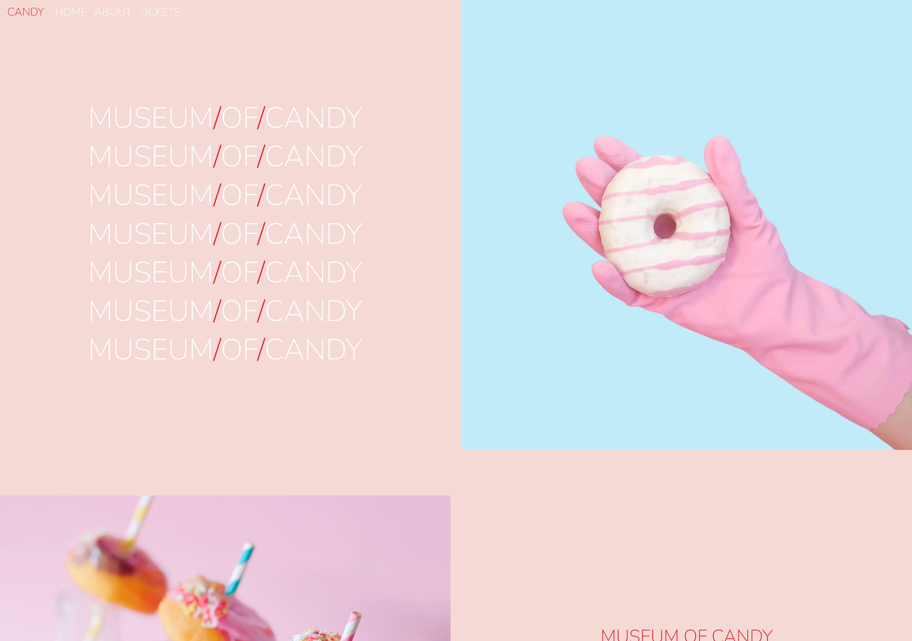

# 🍬 Museum Of Candy

## 📝 Project Description

Museum Of Candy is a vibrant, responsive landing page inspired by modern museum and candy shop aesthetics. The project showcases creative use of Bootstrap, custom CSS, and Google Fonts to deliver a visually engaging user experience. It features interactive navigation, playful imagery, and a clean, mobile-friendly layout.

## 🛠️ Built Using

## 📚 What I've Learned

- How to build responsive layouts using Bootstrap's grid system and utilities.
- Customizing styles with CSS and integrating Google Fonts for unique typography.
- Enhancing user experience with interactive navigation using jQuery.
- Organizing project assets and structuring HTML for clarity and maintainability.

## ⚠️ Challenges Faced

- Achieving seamless responsiveness across all device sizes.
- Fine-tuning custom CSS to override Bootstrap defaults without breaking layout.
- Managing image assets for optimal loading and display.
- Ensuring consistent design and color themes throughout the project.

## 📬 Contact Me

